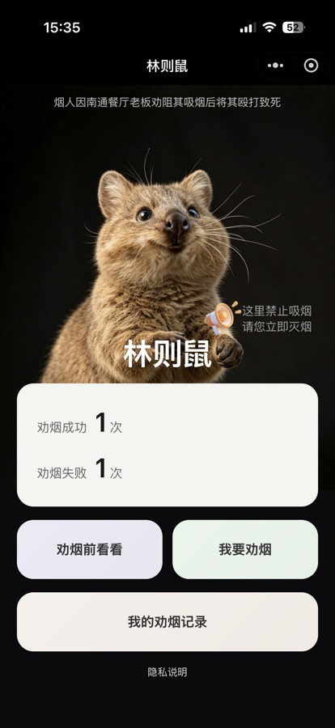

# 林则鼠

林则鼠是一款已经上线的公益控烟微信小程序，面向在上海公共场所受到二手烟影响、希望了解控烟规定或进行安全劝阻的普通市民。

项目通过控烟知识、安全提醒、劝烟录制与本地记录等功能，降低市民了解规定和开展劝阻的门槛。本仓库公开小程序客户端、开发联调用 Mock API，以及产品和技术方案文档。

> 安全提示：请始终优先保障人身安全。现场存在冲突风险时，不建议正面劝阻。

## 产品截图

<p align="center">
  
</p>

微信内搜索小程序 **“林则鼠”** 可以访问已上线版本。

## 当前功能

- 控烟安全提醒与公益宣传内容
- 控烟法规及劝烟前知识页面
- 相机和麦克风授权引导
- 劝烟过程录像及固定语音播报
- 录制过程手动拍照
- 照片和视频保存至用户设备
- 劝烟成功或失败结果记录
- 本地劝烟记录、回看和统计
- 外部法规页面跳转
- 用于开发联调的 Express Mock API

## 当前边界

仓库中部分文档描述了项目的长期设计目标。以下能力目前属于模拟、预留接口或后续规划，不应视为已经完成的线上能力：

- 实时语音识别与生成式 AI 辩驳
- 政府账号自动关联
- 向官方举报平台自动上传数据
- 正式的城市控烟热力图数据对接
- 面向生产环境的后端、内容管理和运营系统

当前上线版本的劝烟记录、截图路径和统计数据主要保存在用户本地。`server/` 仅用于本地开发与接口联调，不代表生产服务。

## 项目结构

```text
.
├── client/              # 微信小程序客户端
│   ├── pages/           # 首页、科普、相机、记录和网页页面
│   ├── audio/           # 固定语音播报资源
│   ├── images/          # 客户端图片资源
│   └── utils/           # 常量及地理位置工具
├── server/              # Express Mock API
├── docs/images/         # README 展示图片
├── PRD.md               # 产品需求文档
├── SPEC.md              # 技术方案与长期规划
└── project.config.json  # 微信开发者工具配置
```

## 本地运行小程序

### 前置条件

- 微信开发者工具
- 可用于本地调试的微信小程序 AppID，或微信开发者工具的游客模式

### 操作步骤

1. 克隆仓库：

   ```bash
   git clone https://github.com/Iman-GGG/linzeshu.git
   cd linzeshu
   ```

2. 打开微信开发者工具。
3. 导入项目，并选择仓库中的 `client/` 目录。
4. 仓库默认使用 `touristappid`，不会公开绑定正式小程序身份。如需使用自己的 AppID，请通过微信开发者工具在本地配置；不要提交正式 AppID、AppSecret 或私有配置。
5. 编译并在模拟器或已授权的真机上测试。

相机、麦克风、相册和部分隐私授权能力需要真机环境才能完整验证。

## 本地运行 Mock API

需要 Node.js 18 或更高版本。

```bash
cd server
npm install
API_KEY=local-development-key npm start
```

默认监听地址为 `http://localhost:3000`。调用 `/api` 下的接口时，通过 `x-api-key` 请求头提供相同的开发密钥。

Mock API 使用本地 JSON 文件作为开发数据存储，不适合生产环境、多人协作写入或保存敏感数据。

## 隐私与安全

- 不要在 Issue、Pull Request、截图或测试数据中提交真实姓名、联系方式、健康信息或其他个人数据。
- 不要将微信 AppSecret、地图服务密钥、API 密钥或生产配置提交到仓库。
- 录制前应取得必要授权，并遵守所在地关于隐私、肖像、录音录像和个人信息保护的规定。
- 项目内容用于公益宣传和信息辅助，不构成法律意见、医疗建议或执法授权。
- 发现安全问题时，请不要公开披露可利用细节；项目将通过 `SECURITY.md` 提供私下报告方式。

## 项目文档

- [产品需求文档](PRD.md)
- [技术方案](SPEC.md)
- [公开路线图](ROADMAP.md)
- [参与贡献](CONTRIBUTING.md)
- [安全政策](SECURITY.md)
- [客户端说明](client/README.md)
- [Mock API 说明](server/README.md)

## 参与贡献

欢迎通过 Issue 和 Pull Request 参与项目。在提交较大改动前，请先创建 Issue 说明使用场景、范围和隐私影响，并阅读 [CONTRIBUTING.md](CONTRIBUTING.md)。健康或法规相关内容应提供可靠来源，并经过人工核对。

## 维护者

本项目由 [@Iman-GGG](https://github.com/Iman-GGG) 发起并维护。

## 许可证

本项目基于 [Apache License 2.0](LICENSE) 开源。
